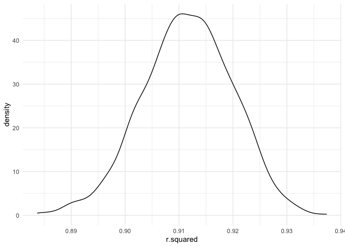
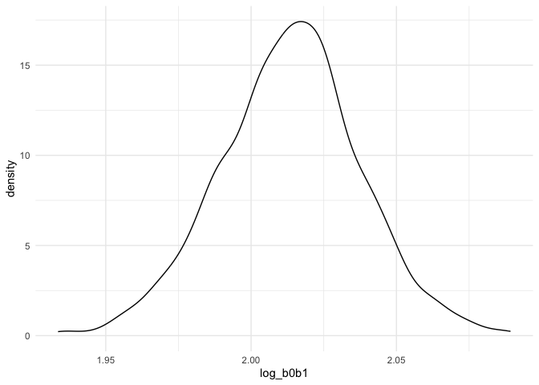
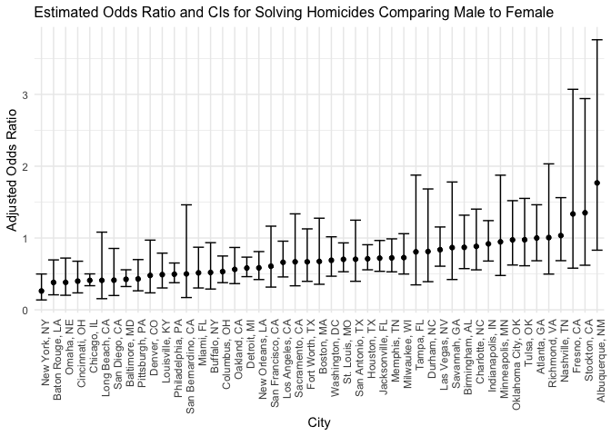
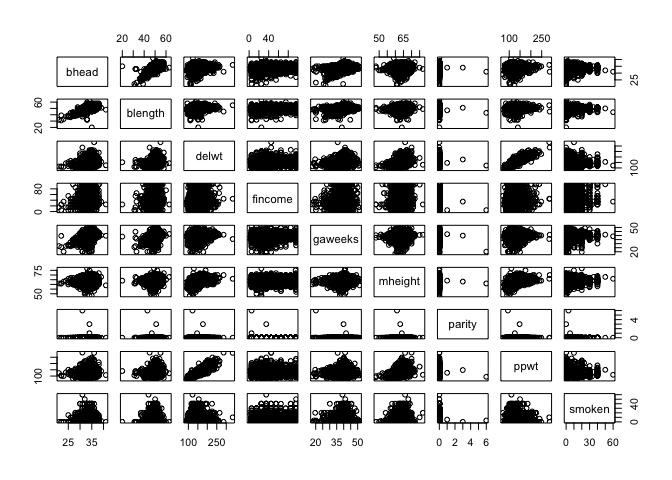
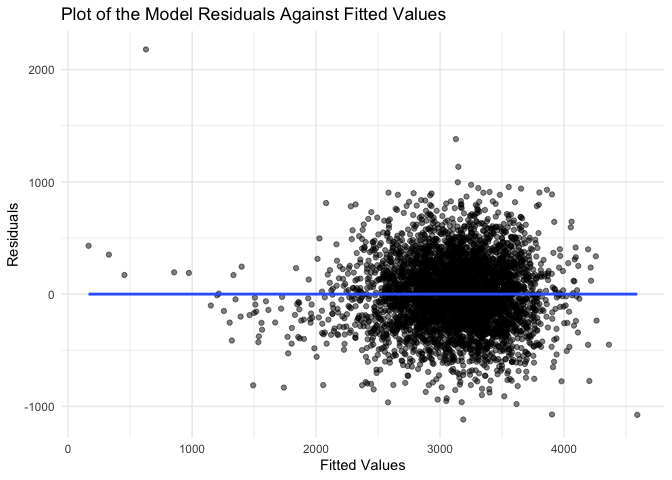

Homework 6
================
Yifei Xu
2022-12-02

### Problem 1

To obtain a distribution for $\hat{r}^2$, we’ll follow basically the
same procedure we used for regression coefficients: draw bootstrap
samples; the a model to each; extract the value I’m concerned with; and
summarize. Here, we’ll use `modelr::bootstrap` to draw the samples and
`broom::glance` to produce `r.squared` values.

``` r
weather_df = 
  rnoaa::meteo_pull_monitors(
    c("USW00094728"),
    var = c("PRCP", "TMIN", "TMAX"), 
    date_min = "2017-01-01",
    date_max = "2017-12-31") %>%
  mutate(
    name = recode(id, USW00094728 = "CentralPark_NY"),
    tmin = tmin / 10,
    tmax = tmax / 10) %>%
  select(name, id, everything())
```

    ## Registered S3 method overwritten by 'hoardr':
    ##   method           from
    ##   print.cache_info httr

    ## using cached file: ~/Library/Caches/R/noaa_ghcnd/USW00094728.dly

    ## date created (size, mb): 2022-09-29 10:33:57 (8.401)

    ## file min/max dates: 1869-01-01 / 2022-09-30

``` r
weather_df %>% 
  modelr::bootstrap(n = 1000) %>% 
  mutate(
    models = map(strap, ~lm(tmax ~ tmin, data = .x) ),
    results = map(models, broom::glance)) %>% 
  select(-strap, -models) %>% 
  unnest(results) %>% 
  ggplot(aes(x = r.squared)) + geom_density()
```

<!-- -->

In this example, the $\hat{r}^2$ value is high, and the upper bound at 1
may be a cause for the generally skewed shape of the distribution. If we
wanted to construct a confidence interval for $R^2$, we could take the
2.5% and 97.5% quantiles of the estimates across bootstrap samples.
However, because the shape isn’t symmetric, using the mean +/- 1.96
times the standard error probably wouldn’t work well.

We can produce a distribution for $\log(\beta_0 * \beta1)$ using a
similar approach, with a bit more wrangling before we make our plot.

``` r
weather_df %>% 
  modelr::bootstrap(n = 1000) %>% 
  mutate(
    models = map(strap, ~lm(tmax ~ tmin, data = .x) ),
    results = map(models, broom::tidy)) %>% 
  select(-strap, -models) %>% 
  unnest(results) %>% 
  select(id = `.id`, term, estimate) %>% 
  pivot_wider(
    names_from = term, 
    values_from = estimate) %>% 
  rename(beta0 = `(Intercept)`, beta1 = tmin) %>% 
  mutate(log_b0b1 = log(beta0 * beta1)) %>% 
  ggplot(aes(x = log_b0b1)) + geom_density()
```

<!-- -->

As with $r^2$, this distribution is somewhat skewed and has some
outliers.

The point of this is not to say you should always use the bootstrap –
it’s possible to establish “large sample” distributions for strange
parameters / values / summaries in a lot of cases, and those are great
to have. But it is helpful to know that there’s a way to do inference
even in tough cases.

### Problem 2

First, import the dataset from the GitHub repository.

``` r
data_url = "https://raw.githubusercontent.com/washingtonpost/data-homicides/master/homicide-data.csv"

homicide = read_csv(url(data_url)) 
```

Second, clean the dataset as required.

``` r
homicide_tidy = homicide %>%
  janitor::clean_names() %>%
  mutate(state = toupper(state)) %>%
  mutate(city_state = str_c(city, state, sep = ", ")) %>%
  filter(!city_state %in% c("Tulsa, AL", "Dallas, TX", "Phoenix, AZ", "Kansas City, MO")) %>%
  filter(victim_race %in% c("White", "Black")) %>%
  mutate(reported_date = as.Date(as.character(reported_date), format = "%Y%m%d"),
         city_state = str_c(city, state, sep = ", "), 
         resolved = as.numeric(disposition == "Closed by arrest"),
         victim_age = as.numeric(victim_age),
         victim_sex = fct_relevel(victim_sex, "Female")) %>% 
  select(city_state, everything()) 
```

    ## Warning in mask$eval_all_mutate(quo): NAs introduced by coercion

Third, fit a logistic regression for the city of Baltimore, MD.

``` r
# filter out the records in Baltimore, MD
baltimore_df = homicide_tidy %>%
  filter(city_state == "Baltimore, MD") 

# GLE
fit_logistic = 
  baltimore_df %>% 
  glm(resolved ~ victim_age + victim_sex + victim_race, data = ., family = binomial()) 

# summary
fit_summary = fit_logistic %>% 
  broom::tidy() %>% 
  mutate(OR = exp(estimate),
         conf_low = exp(estimate - 1.96 * std.error),
         conf_high = exp(estimate + 1.96 * std.error)) %>%
  select(term, OR, conf_low, conf_high) 

fit_summary
```

    ## # A tibble: 4 × 4
    ##   term                OR conf_low conf_high
    ##   <chr>            <dbl>    <dbl>     <dbl>
    ## 1 (Intercept)      1.36     0.975     1.91 
    ## 2 victim_age       0.993    0.987     1.00 
    ## 3 victim_sexMale   0.426    0.325     0.558
    ## 4 victim_raceWhite 2.32     1.65      3.27

``` r
# sex
fit_summary %>%
  filter(term == "victim_sexMale")%>%
  mutate(term = str_replace(term, "victim_sex", "Sex: ")) %>%
  knitr::kable(col.names = c("Term", "Adjusted Odds Ratio", "Lower CI", "Upper CI"),
               caption = "Odds Ratio and CIs for Solving Homicides in Baltimore Comparing Male to Female",
               digits = 3)
```

| Term      | Adjusted Odds Ratio | Lower CI | Upper CI |
|:----------|--------------------:|---------:|---------:|
| Sex: Male |               0.426 |    0.325 |    0.558 |

Odds Ratio and CIs for Solving Homicides in Baltimore Comparing Male to
Female

Homicides in which the victim is male are significantly less like to be
resolved than those in which the victim is female.

Fourth, run glm for each of the cities.

``` r
city_gle = 
  homicide_tidy %>% 
  nest(data = -city_state) %>% 
  mutate(models = map(.x = data, ~glm(resolved ~ victim_age + victim_sex + victim_race, data = .x, family = binomial())),
         results = map(models, broom::tidy)) %>% 
  select(city_state, results) %>% 
  unnest(results) %>% 
  mutate(OR = exp(estimate),
         conf_low = exp(estimate - 1.96 * std.error),
         conf_high = exp(estimate + 1.96 * std.error)) %>% 
  select(city_state, term, OR, conf_low, conf_high) 

# sex
city_gle %>%
  filter(term == "victim_sexMale")%>%
  select(-term) %>%
  knitr::kable(col.names = c("City", "Adjusted Odds Ratio", "Lower CI", "Upper CI"),
               caption = "Odds Ratio and CIs for Solving Homicides Comparing Male to Female",
               digits = 3)
```

| City               | Adjusted Odds Ratio | Lower CI | Upper CI |
|:-------------------|--------------------:|---------:|---------:|
| Albuquerque, NM    |               1.767 |    0.831 |    3.761 |
| Atlanta, GA        |               1.000 |    0.684 |    1.463 |
| Baltimore, MD      |               0.426 |    0.325 |    0.558 |
| Baton Rouge, LA    |               0.381 |    0.209 |    0.695 |
| Birmingham, AL     |               0.870 |    0.574 |    1.318 |
| Boston, MA         |               0.674 |    0.356 |    1.276 |
| Buffalo, NY        |               0.521 |    0.290 |    0.935 |
| Charlotte, NC      |               0.884 |    0.557 |    1.403 |
| Chicago, IL        |               0.410 |    0.336 |    0.501 |
| Cincinnati, OH     |               0.400 |    0.236 |    0.677 |
| Columbus, OH       |               0.532 |    0.378 |    0.750 |
| Denver, CO         |               0.479 |    0.236 |    0.971 |
| Detroit, MI        |               0.582 |    0.462 |    0.734 |
| Durham, NC         |               0.812 |    0.392 |    1.683 |
| Fort Worth, TX     |               0.669 |    0.397 |    1.127 |
| Fresno, CA         |               1.335 |    0.580 |    3.071 |
| Houston, TX        |               0.711 |    0.558 |    0.907 |
| Indianapolis, IN   |               0.919 |    0.679 |    1.242 |
| Jacksonville, FL   |               0.720 |    0.537 |    0.966 |
| Las Vegas, NV      |               0.837 |    0.608 |    1.154 |
| Long Beach, CA     |               0.410 |    0.156 |    1.082 |
| Los Angeles, CA    |               0.662 |    0.458 |    0.956 |
| Louisville, KY     |               0.491 |    0.305 |    0.790 |
| Memphis, TN        |               0.723 |    0.529 |    0.988 |
| Miami, FL          |               0.515 |    0.304 |    0.872 |
| Milwaukee, WI      |               0.727 |    0.499 |    1.060 |
| Minneapolis, MN    |               0.947 |    0.478 |    1.875 |
| Nashville, TN      |               1.034 |    0.685 |    1.562 |
| New Orleans, LA    |               0.585 |    0.422 |    0.811 |
| New York, NY       |               0.262 |    0.138 |    0.499 |
| Oakland, CA        |               0.563 |    0.365 |    0.868 |
| Oklahoma City, OK  |               0.974 |    0.624 |    1.520 |
| Omaha, NE          |               0.382 |    0.203 |    0.721 |
| Philadelphia, PA   |               0.496 |    0.378 |    0.652 |
| Pittsburgh, PA     |               0.431 |    0.265 |    0.700 |
| Richmond, VA       |               1.006 |    0.498 |    2.033 |
| San Antonio, TX    |               0.705 |    0.398 |    1.249 |
| Sacramento, CA     |               0.669 |    0.335 |    1.337 |
| Savannah, GA       |               0.867 |    0.422 |    1.780 |
| San Bernardino, CA |               0.500 |    0.171 |    1.462 |
| San Diego, CA      |               0.413 |    0.200 |    0.855 |
| San Francisco, CA  |               0.608 |    0.317 |    1.165 |
| St. Louis, MO      |               0.703 |    0.530 |    0.932 |
| Stockton, CA       |               1.352 |    0.621 |    2.942 |
| Tampa, FL          |               0.808 |    0.348 |    1.876 |
| Tulsa, OK          |               0.976 |    0.614 |    1.552 |
| Washington, DC     |               0.690 |    0.468 |    1.017 |

Odds Ratio and CIs for Solving Homicides Comparing Male to Female

Finally, create a plot that shows the estimated ORs and CIs for each
city.

``` r
city_gle %>% 
  filter(term == "victim_sexMale") %>% 
  mutate(city_state = fct_reorder(city_state, OR)) %>% 
  ggplot(aes(x = city_state, y = OR)) + 
  geom_point() + 
  geom_errorbar(aes(ymin = conf_low, ymax = conf_high)) + 
  labs(x = "City", 
       y = "Adjusted Odds Ratio",
       title = "Estimated Odds Ratio and CIs for Solving Homicides Comparing Male to Female") +
  theme(axis.text.x = element_text(angle = 90, hjust = 1),
        plot.title = element_text(size = 12))
```

<!-- -->

For 87.23% of the cities, the estimate odds ratio for solving homicides
for males comparing to females is less than one. In addition, for some
of those cities (OR\<1) such as New York and Baton Rouge, the odds ratio
confidence interval does not include 1, which means the homicides in
which the victim is male are significantly less likely to be resolved
than those in which the victim is female.

### Problem 3

### Data Import

``` r
birthweight = read_csv("data/birthweight.csv")
```

### Data Preprocessing

``` r
birthweight_tidy =
  birthweight %>% 
  janitor::clean_names() %>%
  mutate(across(.cols = c(babysex, frace, malform, mrace), as.factor)) %>%
  mutate(babysex = case_when(babysex == 1 ~"male", babysex == 2 ~"female"),
         malform = case_when(malform == 0 ~"absent", malform == 1 ~ "present"),
         frace = recode(frace, 
                        "1" = "White", 
                        "2" = "Black", 
                        "3" = "Asian", 
                        "4" = "Puerto Rican", 
                        "8" = "Other", 
                        "9" = "Unknown"),
         mrace = recode(mrace, 
                        "1" = "White", 
                        "2" = "Black", 
                        "3" = "Asian", 
                        "4" = "Puerto Rican", 
                        "8" = "Other"))

# check missing values
sum(is.na(birthweight_tidy))
```

    ## [1] 0

### Propose a Regression Model for Birthweight.

First, I use stepwise method to select variables.

``` r
mult_fit = lm(bwt ~ ., data=birthweight_tidy)
step(mult_fit, direction="both")
```

    ## Start:  AIC=48717.83
    ## bwt ~ babysex + bhead + blength + delwt + fincome + frace + gaweeks + 
    ##     malform + menarche + mheight + momage + mrace + parity + 
    ##     pnumlbw + pnumsga + ppbmi + ppwt + smoken + wtgain
    ## 
    ## 
    ## Step:  AIC=48717.83
    ## bwt ~ babysex + bhead + blength + delwt + fincome + frace + gaweeks + 
    ##     malform + menarche + mheight + momage + mrace + parity + 
    ##     pnumlbw + pnumsga + ppbmi + ppwt + smoken
    ## 
    ## 
    ## Step:  AIC=48717.83
    ## bwt ~ babysex + bhead + blength + delwt + fincome + frace + gaweeks + 
    ##     malform + menarche + mheight + momage + mrace + parity + 
    ##     pnumlbw + ppbmi + ppwt + smoken
    ## 
    ## 
    ## Step:  AIC=48717.83
    ## bwt ~ babysex + bhead + blength + delwt + fincome + frace + gaweeks + 
    ##     malform + menarche + mheight + momage + mrace + parity + 
    ##     ppbmi + ppwt + smoken
    ## 
    ##            Df Sum of Sq       RSS   AIC
    ## - frace     4    124365 320848704 48712
    ## - malform   1      1419 320725757 48716
    ## - ppbmi     1      6346 320730684 48716
    ## - momage    1     28661 320752999 48716
    ## - mheight   1     66886 320791224 48717
    ## - menarche  1    111679 320836018 48717
    ## - ppwt      1    131132 320855470 48718
    ## <none>                  320724338 48718
    ## - fincome   1    193454 320917792 48718
    ## - parity    1    413584 321137922 48721
    ## - mrace     3    868321 321592659 48724
    ## - babysex   1    853796 321578134 48727
    ## - gaweeks   1   4611823 325336161 48778
    ## - smoken    1   5076393 325800732 48784
    ## - delwt     1   8008891 328733230 48823
    ## - blength   1 102050296 422774634 49915
    ## - bhead     1 106535716 427260054 49961
    ## 
    ## Step:  AIC=48711.51
    ## bwt ~ babysex + bhead + blength + delwt + fincome + gaweeks + 
    ##     malform + menarche + mheight + momage + mrace + parity + 
    ##     ppbmi + ppwt + smoken
    ## 
    ##            Df Sum of Sq       RSS   AIC
    ## - malform   1      1447 320850151 48710
    ## - ppbmi     1      6975 320855679 48710
    ## - momage    1     28379 320877083 48710
    ## - mheight   1     69502 320918206 48710
    ## - menarche  1    115708 320964411 48711
    ## - ppwt      1    133961 320982665 48711
    ## <none>                  320848704 48712
    ## - fincome   1    194405 321043108 48712
    ## - parity    1    414687 321263390 48715
    ## + frace     4    124365 320724338 48718
    ## - babysex   1    852133 321700837 48721
    ## - gaweeks   1   4625208 325473911 48772
    ## - smoken    1   5036389 325885093 48777
    ## - delwt     1   8013099 328861802 48817
    ## - mrace     3  13540415 334389119 48885
    ## - blength   1 101995688 422844392 49908
    ## - bhead     1 106662962 427511666 49956
    ## 
    ## Step:  AIC=48709.53
    ## bwt ~ babysex + bhead + blength + delwt + fincome + gaweeks + 
    ##     menarche + mheight + momage + mrace + parity + ppbmi + ppwt + 
    ##     smoken
    ## 
    ##            Df Sum of Sq       RSS   AIC
    ## - ppbmi     1      6928 320857079 48708
    ## - momage    1     28660 320878811 48708
    ## - mheight   1     69320 320919470 48708
    ## - menarche  1    116027 320966177 48709
    ## - ppwt      1    133894 320984044 48709
    ## <none>                  320850151 48710
    ## - fincome   1    193784 321043934 48710
    ## + malform   1      1447 320848704 48712
    ## - parity    1    414482 321264633 48713
    ## + frace     4    124393 320725757 48716
    ## - babysex   1    851279 321701430 48719
    ## - gaweeks   1   4624003 325474154 48770
    ## - smoken    1   5035195 325885346 48775
    ## - delwt     1   8029079 328879230 48815
    ## - mrace     3  13553320 334403471 48883
    ## - blength   1 102009225 422859375 49906
    ## - bhead     1 106675331 427525481 49954
    ## 
    ## Step:  AIC=48707.63
    ## bwt ~ babysex + bhead + blength + delwt + fincome + gaweeks + 
    ##     menarche + mheight + momage + mrace + parity + ppwt + smoken
    ## 
    ##            Df Sum of Sq       RSS   AIC
    ## - momage    1     29211 320886290 48706
    ## - menarche  1    117635 320974714 48707
    ## <none>                  320857079 48708
    ## - fincome   1    195199 321052278 48708
    ## + ppbmi     1      6928 320850151 48710
    ## + malform   1      1400 320855679 48710
    ## - parity    1    412984 321270064 48711
    ## + frace     4    125020 320732060 48714
    ## - babysex   1    850020 321707099 48717
    ## - mheight   1   1078673 321935752 48720
    ## - ppwt      1   2934023 323791103 48745
    ## - gaweeks   1   4621504 325478583 48768
    ## - smoken    1   5039368 325896447 48773
    ## - delwt     1   8024939 328882018 48813
    ## - mrace     3  13551444 334408523 48881
    ## - blength   1 102018559 422875638 49904
    ## - bhead     1 106821342 427678421 49953
    ## 
    ## Step:  AIC=48706.02
    ## bwt ~ babysex + bhead + blength + delwt + fincome + gaweeks + 
    ##     menarche + mheight + mrace + parity + ppwt + smoken
    ## 
    ##            Df Sum of Sq       RSS   AIC
    ## - menarche  1    100121 320986412 48705
    ## <none>                  320886290 48706
    ## - fincome   1    240800 321127090 48707
    ## + momage    1     29211 320857079 48708
    ## + ppbmi     1      7479 320878811 48708
    ## + malform   1      1678 320884612 48708
    ## - parity    1    431433 321317724 48710
    ## + frace     4    124743 320761547 48712
    ## - babysex   1    841278 321727568 48715
    ## - mheight   1   1076739 321963029 48719
    ## - ppwt      1   2913653 323799943 48743
    ## - gaweeks   1   4676469 325562760 48767
    ## - smoken    1   5045104 325931394 48772
    ## - delwt     1   8000672 328886962 48811
    ## - mrace     3  14667730 335554021 48894
    ## - blength   1 101990556 422876847 49902
    ## - bhead     1 106864308 427750598 49952
    ## 
    ## Step:  AIC=48705.38
    ## bwt ~ babysex + bhead + blength + delwt + fincome + gaweeks + 
    ##     mheight + mrace + parity + ppwt + smoken
    ## 
    ##            Df Sum of Sq       RSS   AIC
    ## <none>                  320986412 48705
    ## + menarche  1    100121 320886290 48706
    ## - fincome   1    245637 321232048 48707
    ## + momage    1     11698 320974714 48707
    ## + ppbmi     1      8823 320977589 48707
    ## + malform   1      1884 320984528 48707
    ## - parity    1    422770 321409181 48709
    ## + frace     4    128726 320857686 48712
    ## - babysex   1    846134 321832545 48715
    ## - mheight   1   1012240 321998651 48717
    ## - ppwt      1   2907049 323893461 48743
    ## - gaweeks   1   4662501 325648912 48766
    ## - smoken    1   5073849 326060260 48771
    ## - delwt     1   8137459 329123871 48812
    ## - mrace     3  14683609 335670021 48894
    ## - blength   1 102191779 423178191 49903
    ## - bhead     1 106779754 427766166 49950

    ## 
    ## Call:
    ## lm(formula = bwt ~ babysex + bhead + blength + delwt + fincome + 
    ##     gaweeks + mheight + mrace + parity + ppwt + smoken, data = birthweight_tidy)
    ## 
    ## Coefficients:
    ##       (Intercept)        babysexmale              bhead            blength  
    ##         -6070.264            -28.558            130.777             74.947  
    ##             delwt            fincome            gaweeks            mheight  
    ##             4.107              0.318             11.592              6.594  
    ##        mraceBlack         mraceAsian  mracePuerto Rican             parity  
    ##          -138.792            -74.887           -100.678             96.305  
    ##              ppwt             smoken  
    ##            -2.676             -4.843

After stepwise selection, I get `babysex`, `bhead`, `blength`, `delwt`,
`fincome`, `gaweeks`, `mheight`, `mrace`, `parity`, `ppwt` and `smoken`
left in the model.

``` r
mult_fit_1 = lm(bwt ~  babysex + bhead + blength + delwt + fincome + gaweeks + mheight + mrace + parity + ppwt + smoken,
              data=birthweight_tidy)

summary(mult_fit_1)
```

    ## 
    ## Call:
    ## lm(formula = bwt ~ babysex + bhead + blength + delwt + fincome + 
    ##     gaweeks + mheight + mrace + parity + ppwt + smoken, data = birthweight_tidy)
    ## 
    ## Residuals:
    ##      Min       1Q   Median       3Q      Max 
    ## -1097.18  -185.52    -3.39   174.14  2353.44 
    ## 
    ## Coefficients:
    ##                     Estimate Std. Error t value Pr(>|t|)    
    ## (Intercept)       -6070.2639   136.9081 -44.338  < 2e-16 ***
    ## babysexmale         -28.5580     8.4549  -3.378 0.000737 ***
    ## bhead               130.7770     3.4466  37.944  < 2e-16 ***
    ## blength              74.9471     2.0190  37.120  < 2e-16 ***
    ## delwt                 4.1067     0.3921  10.475  < 2e-16 ***
    ## fincome               0.3180     0.1747   1.820 0.068844 .  
    ## gaweeks              11.5925     1.4621   7.929 2.79e-15 ***
    ## mheight               6.5940     1.7849   3.694 0.000223 ***
    ## mraceBlack         -138.7925     9.9071 -14.009  < 2e-16 ***
    ## mraceAsian          -74.8868    42.3146  -1.770 0.076837 .  
    ## mracePuerto Rican  -100.6781    19.3247  -5.210 1.98e-07 ***
    ## parity               96.3047    40.3362   2.388 0.017004 *  
    ## ppwt                 -2.6756     0.4274  -6.261 4.20e-10 ***
    ## smoken               -4.8434     0.5856  -8.271  < 2e-16 ***
    ## ---
    ## Signif. codes:  0 '***' 0.001 '**' 0.01 '*' 0.05 '.' 0.1 ' ' 1
    ## 
    ## Residual standard error: 272.3 on 4328 degrees of freedom
    ## Multiple R-squared:  0.7181, Adjusted R-squared:  0.7173 
    ## F-statistic: 848.1 on 13 and 4328 DF,  p-value: < 2.2e-16

Second, I would like to explore the collinearity among these selected
continuous variables.

``` r
fit_var = birthweight_tidy %>%
  select(bhead, blength, delwt, fincome, gaweeks, mheight, parity, ppwt, smoken)

# Correlation matrix for all selected continuous variables
cor(fit_var)
```

    ##               bhead     blength        delwt     fincome     gaweeks
    ## bhead    1.00000000  0.63045480  0.214370719  0.11569915  0.37845649
    ## blength  0.63045480  1.00000000  0.229149444  0.07874506  0.35926367
    ## delwt    0.21437072  0.22914944  1.000000000  0.03499435  0.12427846
    ## fincome  0.11569915  0.07874506  0.034994354  1.00000000  0.10667767
    ## gaweeks  0.37845649  0.35926367  0.124278465  0.10667767  1.00000000
    ## mheight  0.11694817  0.16025985  0.411257622  0.13101860  0.06213774
    ## parity  -0.02003952 -0.03247008 -0.004709123 -0.02594241 -0.07965885
    ## ppwt     0.13660883  0.14860464  0.870913274  0.04725264  0.05647304
    ## smoken  -0.05394723 -0.06562883  0.048612734  0.07794305  0.03621168
    ##             mheight       parity        ppwt       smoken
    ## bhead    0.11694817 -0.020039523  0.13660883 -0.053947231
    ## blength  0.16025985 -0.032470081  0.14860464 -0.065628829
    ## delwt    0.41125762 -0.004709123  0.87091327  0.048612734
    ## fincome  0.13101860 -0.025942406  0.04725264  0.077943047
    ## gaweeks  0.06213774 -0.079658854  0.05647304  0.036211682
    ## mheight  1.00000000 -0.013423739  0.42668724  0.060983516
    ## parity  -0.01342374  1.000000000 -0.01120295 -0.005575698
    ## ppwt     0.42668724 -0.011202947  1.00000000  0.038854748
    ## smoken   0.06098352 -0.005575698  0.03885475  1.000000000

``` r
# Scatter plot matrix for all selected continuous variables
pairs(fit_var)
```

<!-- -->

From the plot above, we can observe that the a potential collinearity
might exsit between `delwt` and `ppwt`, as well as `bhead` and
`blength`. Therefore, I plan to drop `ppwt` and `blength` whose p-values
are relatively larger in my model.

``` r
# my model
mult_fit_2 = lm(bwt ~  babysex + bhead + delwt + fincome + gaweeks + mheight + mrace + parity + smoken,
              data=birthweight_tidy)

summary(mult_fit_2)
```

    ## 
    ## Call:
    ## lm(formula = bwt ~ babysex + bhead + delwt + fincome + gaweeks + 
    ##     mheight + mrace + parity + smoken, data = birthweight_tidy)
    ## 
    ## Residuals:
    ##      Min       1Q   Median       3Q      Max 
    ## -1116.11  -210.61    -3.63   200.60  2178.91 
    ## 
    ## Coefficients:
    ##                     Estimate Std. Error t value Pr(>|t|)    
    ## (Intercept)       -5.298e+03  1.563e+02 -33.895  < 2e-16 ***
    ## babysexmale       -2.127e+01  9.762e+00  -2.179   0.0294 *  
    ## bhead              1.999e+02  3.376e+00  59.208  < 2e-16 ***
    ## delwt              2.757e+00  2.424e-01  11.373  < 2e-16 ***
    ## fincome           -3.446e-03  2.015e-01  -0.017   0.9864    
    ## gaweeks            2.088e+01  1.663e+00  12.552  < 2e-16 ***
    ## mheight            9.208e+00  2.031e+00   4.533 5.96e-06 ***
    ## mraceBlack        -1.738e+02  1.139e+01 -15.254  < 2e-16 ***
    ## mraceAsian        -7.184e+01  4.884e+01  -1.471   0.1414    
    ## mracePuerto Rican -1.300e+02  2.230e+01  -5.832 5.89e-09 ***
    ## parity             8.142e+01  4.657e+01   1.748   0.0805 .  
    ## smoken            -6.622e+00  6.737e-01  -9.829  < 2e-16 ***
    ## ---
    ## Signif. codes:  0 '***' 0.001 '**' 0.01 '*' 0.05 '.' 0.1 ' ' 1
    ## 
    ## Residual standard error: 314.5 on 4330 degrees of freedom
    ## Multiple R-squared:  0.6238, Adjusted R-squared:  0.6229 
    ## F-statistic: 652.8 on 11 and 4330 DF,  p-value: < 2.2e-16

Next, I will show a plot of model residuals against fitted values.

``` r
birthweight_tidy %>%
  add_residuals(mult_fit_2) %>%
  add_predictions(mult_fit_2) %>%
  ggplot(aes(x = pred, y = resid)) +
  geom_point() +
  geom_smooth(method = "lm", se = FALSE) +
  labs(title = "Plot of the Model Residuals Against Fitted Values",
       x = "Fitted Values", y = "Residuals") 
```

<!-- -->

From the plot of residuals against fitted values above, we can observe a
cluster around 0, and some extreme values when prediction is below 1000.
The constant variance assumption is generally satisfied.

### Model Comparision

``` r
# use length at birth and gestational age as predictors
fit_com_1 = lm(bwt ~ blength + gaweeks, data = birthweight_tidy)

# use head circumference, length, sex, and all interactions
fit_com_2 = lm(bwt ~ bhead + blength + babysex + bhead*blength + bhead*babysex + blength*babysex + bhead*blength*babysex,
               data = birthweight_tidy)

# cross-validation 
cv_df = 
  crossv_mc(birthweight_tidy, 100) %>% 
    mutate(
        train = map(train, as.tibble),
        test = map(test,as.tibble)
    )  %>%
  mutate(
    model_fit1  = map(train, ~lm(bwt ~ babysex + bhead + delwt + fincome + gaweeks + mheight + mrace + parity + smoken,
                                 data = birthweight_tidy)),
    model_fit2  = map(train, ~lm(bwt ~ blength + gaweeks, data = birthweight_tidy)),
    model_fit3  = map(train, ~lm(bwt ~ blength + bhead + babysex + blength*bhead + blength* babysex + bhead*babysex + blength*bhead*babysex, data = birthweight_tidy))) %>% 
  mutate(
    rmse_1 = map2_dbl(model_fit1, test, ~rmse(model = .x, data = .y)),
    rmse_2 = map2_dbl(model_fit2 , test, ~rmse(model = .x, data = .y)),
    rmse_3 = map2_dbl(model_fit3, test, ~rmse(model = .x, data = .y))) 

cv_df %>% 
  select(starts_with("rmse")) %>% 
  pivot_longer(
    everything(),
    names_to = "model", 
    values_to = "rmse",
    names_prefix = "rmse_") %>% 
  mutate(model = fct_inorder(model)) %>% 
  ggplot(aes(x = model, y = rmse)) + 
  geom_violin() +
  labs(title = "Comparison of the Cross-Validated Prediction Error", 
       x = "Models", 
       y = "Root Mean Square Error (RMSE)")  +
  scale_x_discrete(labels = c("My Model", "Test Model 1", "Test Model 2")) 
```

<!-- -->

From RMSE distribution plot above, we can observe that the test model 2
has the lowest RMSE, followed by my model and test model 1. Therefore,
test model 1 is potentially the best model among these three models,
which need to be further analyzed.
